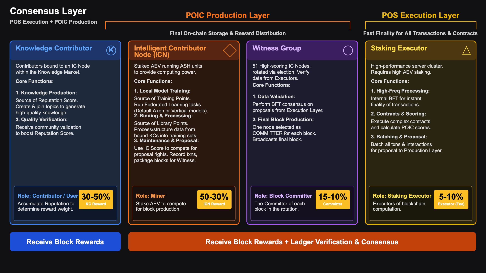

# Dual-Layer Consensus: Execution & Block Production

## Execution Layer: High-Performance Transaction and Compute Engine

The **Execution Layer** is Aevir's "high-speed engine", handling all logic that requires fast response:

- Receiving and ordering user transactions
- Executing smart contracts (including DeFi protocols, AI task scheduling, reward settlement, etc.)
- Calculating contribution scores (IntelliPoints) for all nodes

### Execution Committee

- Composed of **21 high-performance execution nodes**
- Nodes enter the committee by staking $AEV and ranking by stake amount
- Consensus: **PoS + BFT**
  - Similar to classic BFT: one leader proposes a block, others vote
  - When more than 2/3 of nodes sign, an **Execution QC** is formed

### Simplified Transaction Flow

1. Users submit transactions or AI task requests via wallet / DApp;
2. The Execution Layer leader collects transactions and builds a block proposal;
3. 21 execution nodes vote using BFT:
   - If ≥ 2/3 sign, the block is confirmed at the execution layer;
4. Users receive a "pre-confirmation" response within hundreds of milliseconds to a few seconds.

**Why this design?**

- Having a small set of economically bonded, high-performance nodes for execution consensus greatly reduces communication overhead;
- It enables almost Web2-level latency, providing good real-time UX for AI applications, especially inference.

## Block Production Layer: Decentralized Security Guardian

If the Execution Layer is about "running fast", the **Block Production Layer** is about "standing firm".

Its responsibilities:

- Perform a second verification of data coming from the Execution Layer;
- Reach consensus within a larger, more decentralized node set;
- Produce final blocks and "seal" them on-chain.

### Witness BFT and Committer

For each time slot:

1. The Witness Layer receives a candidate block from the Execution Layer (with its Execution QC attached);
2. All 51 witnesses independently verify the candidate (data integrity, consistency, etc.);
3. When **≥ 34 witnesses (over 2/3)** sign, a **Witness QC** is formed;
4. The current **Committer** then packages this into a final block and broadcasts it to the network.
