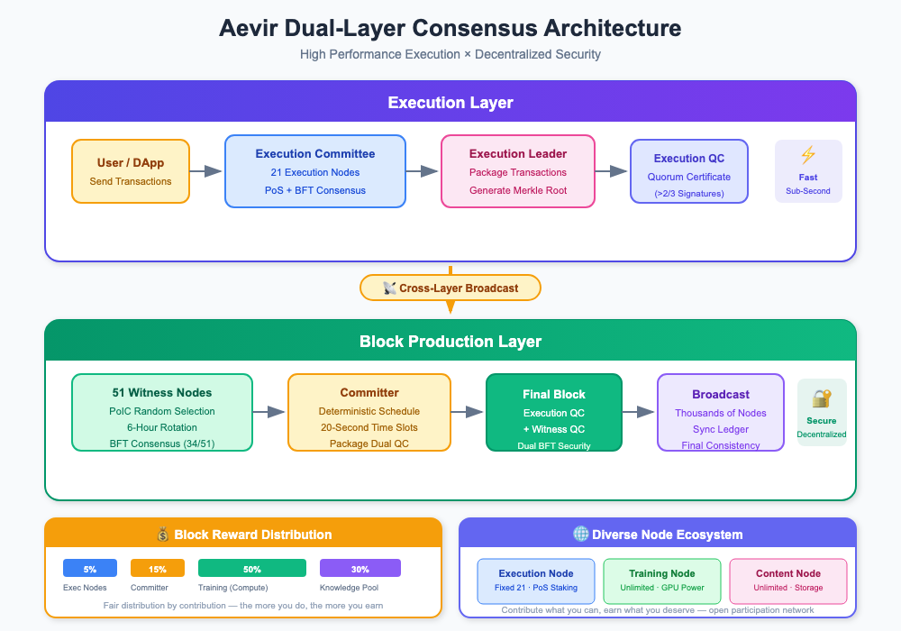

# Architecture Overview

This chapter explains Aevir's underlying blockchain design: why it adopts a dual-layer architecture, what each layer does, and how they work together to deliver near real-time execution for AI workloads while preserving large-scale decentralization.

## The Performance vs. Decentralization Tradeoff

Traditional blockchains often face a tradeoff between **performance** and **decentralization**:

- Increasing TPS and confirmation speed → usually means reducing node count and decentralization;
- Maintaining strong decentralization → leads to more complex consensus and slower confirmations.

Aevir's answer is: **we want both.**

## Dual-Layer Architecture

To achieve this, Aevir adopts a clearly separated dual-layer architecture:

### Execution Layer

- 21 high-performance execution nodes (Execution Committee) using PoS + BFT
- Focused on: transaction execution, smart contracts, AI task scheduling, and contribution accounting
- Goal: **sub-second confirmation and extreme performance**

### Block Production Layer

- A witness network based on PoIC (Proof of Intelligent Contribution)
- Every round, 51 witness nodes are randomly selected from high-contribution nodes
- Focused on: final block production, security attestation, and decentralization
- Goal: **large-scale decentralization and strong security**

## How the Two Layers Collaborate

The two layers collaborate through "proof" and "attestation":

1. The Execution Layer first reaches BFT consensus and produces an Execution QC (quorum certificate);
2. The Block Production Layer then performs a second BFT verification and produces a Witness QC;
3. Finally, a Committer packages the block and broadcasts it to the entire network.

## Core Value of Aevir's Architecture

Through this design, Aevir achieves three key objectives at the architecture level:

1. **Unifying performance and decentralization**

   - The Execution Layer focuses on high performance, while the Block Production Layer focuses on decentralization. Together they deliver "fast and secure".

2. **Consensus and elections centered on real contribution**

   - PoIC quantifies compute, storage, and knowledge contributions into IntelliPoints, directly influencing witness election and reward allocation so that those who _actually contribute_ are rewarded.

3. **Deterministic, auditable, and attack-resistant block production**
   - Dual BFT + VRF randomness + deterministic scheduling make the network both transparent and robust, providing a trustworthy foundation for AI applications and the broader economic system on top.
